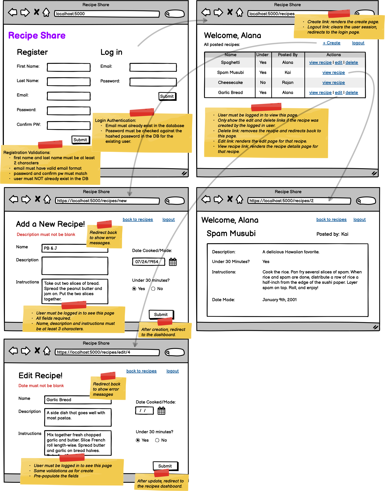

# belt review february 2024




- [application.properties]():

```
# Where are jsp files? HERE!
spring.mvc.view.prefix=/WEB-INF/
# Data Persistence
spring.datasource.url=jdbc:mysql://localhost:3306/belt-review-feb?createDatabaseIfNotExist=true
spring.datasource.username=root
spring.datasource.password=root
spring.jpa.hibernate.ddl-auto=update
# For Update and Delete method hidden inputs
spring.mvc.hiddenmethod.filter.enabled=true
```
- [pom.xml]():

```xml
<!-- DEPENDENCIES FOR DISPLAYING JSPS AND USING JSTL TAGS -->
    <dependency>
        <groupId>org.apache.tomcat.embed</groupId>
        <artifactId>tomcat-embed-jasper</artifactId>
    </dependency>
    <dependency>
        <groupId>jakarta.servlet.jsp.jstl</groupId>
        <artifactId>jakarta.servlet.jsp.jstl-api</artifactId>
    </dependency>
    <dependency>
        <groupId>org.glassfish.web</groupId>
        <artifactId>jakarta.servlet.jsp.jstl</artifactId>
    </dependency>
    <!-- DEPENDENCIES FOR INTEGRATING SQL DATABASE AND USING JPA -->
    <!-- Note: Project will not run until a schema has been created and the 
        proper settings in application properties are present for 
        connecting to a database. -->
    <dependency>
        <groupId>com.mysql</groupId>
        <artifactId>mysql-connector-j</artifactId>
        <scope>runtime</scope>
    </dependency>
    <dependency>
        <groupId>org.springframework.boot</groupId>
        <artifactId>spring-boot-starter-data-jpa</artifactId>
    </dependency>
    <!-- DEPENDENCY FOR USING VALIDATION ANNOTATIONS -->
    <dependency>
        <groupId>org.springframework.boot</groupId>
        <artifactId>spring-boot-starter-validation</artifactId>
    </dependency>
    <!-- DEPENDENCY FOR USING BCRYPT  -->
    <dependency>
        <groupId>org.mindrot</groupId>
        <artifactId>jbcrypt</artifactId>
        <version>0.4</version>
    </dependency>
    <!-- DEPENDENCIES FOR BOOTSTRAP -->
    <dependency>
        <groupId>org.webjars</groupId>
        <artifactId>webjars-locator</artifactId>
        <version>0.46</version>
    </dependency>
    <dependency>
        <groupId>org.webjars</groupId>
        <artifactId>bootstrap</artifactId>
        <version>5.2.3</version>
    </dependency>
```
- Views:
  - [login page]():

```html
<%@ page language="java" contentType="text/html; charset=UTF-8" pageEncoding="UTF-8"%>
<!-- c:out ; c:forEach etc. --> 
<%@ taglib prefix = "c" uri = "http://java.sun.com/jsp/jstl/core" %>
<!-- Formatting (dates) --> 
<%@ taglib uri="http://java.sun.com/jsp/jstl/fmt" prefix="fmt"  %>
<!-- form:form -->
<%@ taglib prefix="form" uri="http://www.springframework.org/tags/form"%>
<!-- for rendering errors on PUT routes -->
<%@ page isErrorPage="true" %>
<!DOCTYPE html>
<html>
<head>
    <meta charset="UTF-8">
    <title>Belt Review</title>
    <link rel="stylesheet" href="/webjars/bootstrap/css/bootstrap.min.css">
    <link rel="stylesheet" href="/css/main.css"> <!-- change to match your file/naming structure -->
    <script src="/webjars/bootstrap/js/bootstrap.min.js"></script>
    <script type="text/javascript" src="/js/app.js"></script><!-- change to match your file/naming structure -->
</head>
<body>
   <div class="container">

    <div class="row">
        <div class="col">
            <h2>Register</h2>
    <form:form action="/register" method="post" modelAttribute="newUser">
    <div class="form-control">
        <form:label path="userName">userName</form:label>
        <form:input path="userName"/>
        <div>
            <form:errors path="userName"/>
        </div>
    </div>
    <div class="form-control">
        <form:label path="email">email</form:label>
        <form:input path="email"/>
        <div>
            <form:errors path="email"/>
        </div>
    </div>
    <div class="form-control">
        <form:label path="password">password</form:label>
        <form:input path="password"/>
        <div>
            <form:errors path="password"/>
        </div>
    </div>
    <div class="form-control">
        <form:label path="confirm"> Password Confirmation</form:label>
        <form:input path="confirm"/>
        <div>
            <form:errors path="confirm"/>     
        </div>
    </div>    
    <input type="submit" value="Submit"/>
</form:form> 


        </div>
        <div class="col">
            <h2>Login</h2>
            <form:form action="/login" method="post" modelAttribute="newLogin">
               
                <div class="form-control">
                    <form:label path="email">email</form:label>
                    <form:input path="email"/>
                    <form:errors path="email"/>
                </div>
                <div class="form-control">
                    <form:label path="password">password</form:label>
                    <form:input path="password"/>
                    <form:errors path="password"/>
                </div>
              
                <input type="submit" value="Submit"/>
            </form:form> 
        </div>
    </div>
   </div>
</body>
</html>

```
  - [show all recipes]()

  - [show one recipe]()

  - [add new recipe]()

  - [edit recipe]()

- Controllers:

  - [MainController.java]():

```java

@Controller
public class HomeController {
    
    @Autowired
    private UserService userService;
    
    @GetMapping("/")
    public String index(Model model) {
        model.addAttribute("newUser", new User());
        model.addAttribute("newLogin", new LoginUser());
        return "index.jsp";
    }
    
    @PostMapping("/register")
    public String register(@Valid @ModelAttribute("newUser") User newUser, 
            BindingResult result, Model model, HttpSession session) {
        
        if(result.hasErrors()) {
            model.addAttribute("newLogin", new LoginUser());
            return "index.jsp";
        }
        
        return "redirect:/home";
    }
    
    @PostMapping("/login")
    public String login(@Valid @ModelAttribute("newLogin") LoginUser newLogin, BindingResult result, Model model, HttpSession session) {

        User user = userService.login(newLogin, result);
    
        if(result.hasErrors()) {
            model.addAttribute("newUser", new User());
            return "index.jsp";
        }
        return "redirect:/home";
    }  
}

```

  - [RecipeController.java]()

- Models:

  - [User.java]():

```java
@Entity
@Table(name="users")
public class User {
    
    @Id
    @GeneratedValue(strategy = GenerationType.IDENTITY)
    private Long id;
    
    @NotEmpty(message="Username is required!")
    @Size(min=3, max=30, message="Username must be between 3 and 30 characters")
    private String userName;
    
    @NotEmpty(message="Email is required!")
    @Email(message="Please enter a valid email!")
    private String email;
    
    @NotEmpty(message="Password is required!")
    @Size(min=8, max=128, message="Password must be between 8 and 128 characters")
    private String password;
    
    @Transient
    @NotEmpty(message="Confirm Password is required!")
    @Size(min=8, max=128, message="Confirm Password must be between 8 and 128 characters")
    private String confirm;
  
    public User() {}
    
    //TODO - Don't forget to generate getters and setters  
}
```

  - [LoginUser.java]():

```java
public class LoginUser {
    
    @NotEmpty(message="Email is required!")
    @Email(message="Please enter a valid email!")
    private String email;
    
    @NotEmpty(message="Password is required!")
    @Size(min=8, max=128, message="Password must be between 8 and 128 characters")
    private String password;
    
    public LoginUser() {}
    
    //TODO - Don't forget to generate getters and setters
}
```
  - [Recipe.java]()

- Repositories:
  - [UserRepository.java]():

```java

public interface UserRepository extends CrudRepository<User, Long> {
    Optional<User> findByEmail(String email);   
}
```

  - [RecipeRepository.java]()

- Services:

  - [UserService.java]():
```java
@Service
public class UserService {
    
    @Autowired
    private UserRepository userRepository;
    
    public User register(User newUser, BindingResult result) {
    
        // Reject if email is taken (present in database)
        if(userRepository.findByEmail(newUser.getEmail()).isPresent()){
            result.rejectValue("email", "Email", "Already Registered");
        }
        // Reject if password doesn't match confirmation
        if(!newUser.getPassword().equals(newUser.getConfirm())){
            result.rejectValue("password", "Password", "passwords must match");
        }
        // Return null if result has errors
        if(result.hasErrors()){
            return null;
        }
            // Hash and set password, save user to database
        String hasedPW = BCrypt.hashpw(newUser.getPassword(), BCrypt.gensalt());
        newUser.setPassword(hasedPW);

        return userRepository.save(newUser);
    }


    public User login(LoginUser newLoginObject, BindingResult result) {
        
        // Find user in the DB by email
        User user = userRepository.findByEmail(newLoginObject.getEmail()).orElse(null);
        // Reject if NOT present
        if(user == null){
            result.rejectValue("email", "EmailLogin", "Invalid Credentials");
        }
        // Reject if BCrypt password match fails
        else if(!BCrypt.checkpw(newLoginObject.getPassword(), user.getPassword())){
            result.rejectValue("password", "PasswordLogin", "Invalid Credentials");
        }
        // Return null if result has errors
            if(result.hasErrors()){
                return null;
            }
        // Otherwise, return the user object
            return user;
    }
}

```
  - [RecipeService.java]():