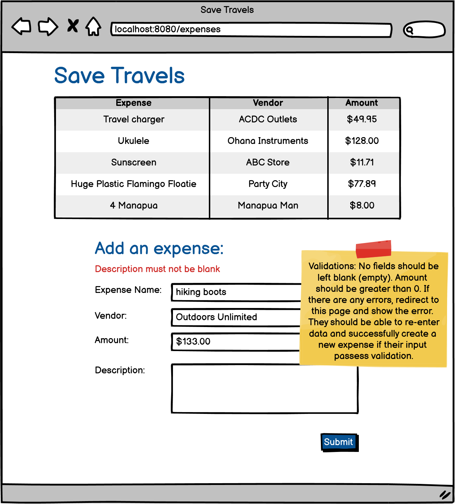
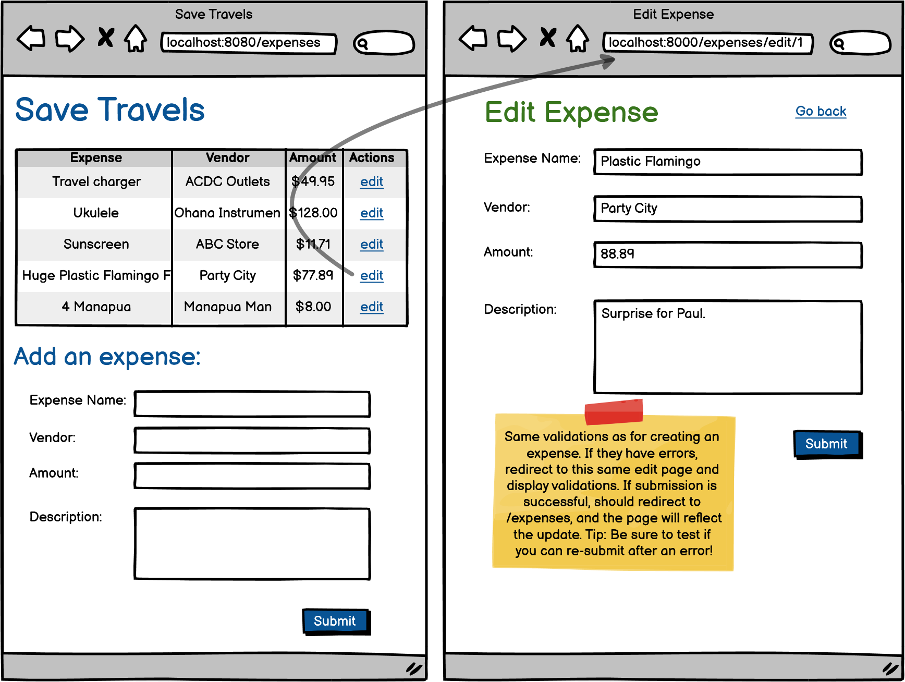
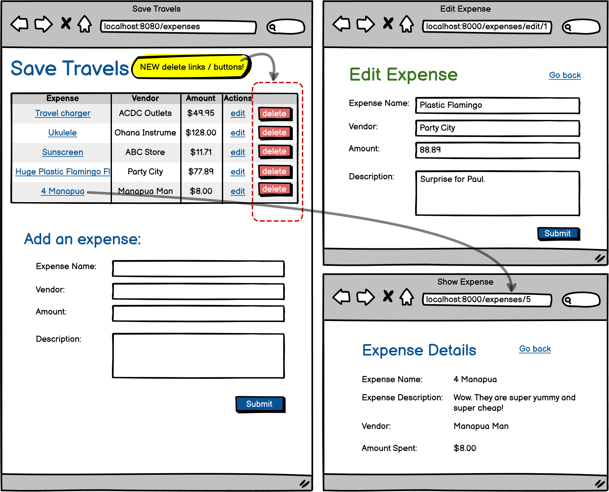

# [Save Travels](https://login.codingdojo.com/m/315/9533/65999)

## preliminary app creation

- [ ] Create an [app](./save-travels/README.md) that keeps track of the user's expenses.
  - [ ] update [application.properties](./save-travels/src/main/resources/application.properties)
  - [ ] update [pom.xml](./save-travels/pom.xml)
  - [ ] create [views](./save-travels/src/main/webapp/WEB-INF/index.jsp) for the main page and for each additional page:
    - [ ] [edit.jsp](./save-travels/src/main/webapp/WEB-INF/edit.jsp)
    - [ ] [show.jsp](./save-travels/src/main/webapp/WEB-INF/show.jsp)
  - [ ] create a [ExpenseController.java](./save-travels/src/main/java/co/tylermaxwell/savetravels/controllers/ExpenseController.java)
  - [ ] create a [Expense.java](./save-travels/src/main/java/co/tylermaxwell/savetravels/models/Expense.java) model.
  - [ ] create a [ExpenseRepository.java](./save-travels/src/main/java/co/tylermaxwell/savetravels/repositories/ExpenseRepository.java).
  - [ ] create a [ExpenseService.java](./save-travels/src/main/java/co/tylermaxwell/savetravels/services/ExpenseService.java).

## part one

- [ ] The [expense]() table should display the name of the expense, the name of the vendor, and the amount paid.
- [ ] Below the table, create a form that allows users to add expenses.
- [ ] Be sure to include the description field in your form. Descriptions will only be visible on the Show and Edit pages.

## part two
- [ ] Allow users to edit their entries.

## part three

- [ ] Allow users to delete their entries.

- [ ] Allow users to click on an expense in order to view its details.

