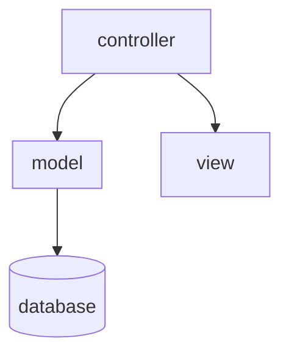

# [MVC Design Pattern](https://login.codingdojo.com/m/315/9533/109115)

## Learning Objectives:

- Review the request-response cycle in the context of organizing back-end logic
- Gain a high-level understanding of the MVC Design pattern and its uses in web development
- Re-iterate the importance of modularization when working on large projects

