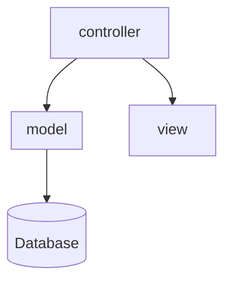
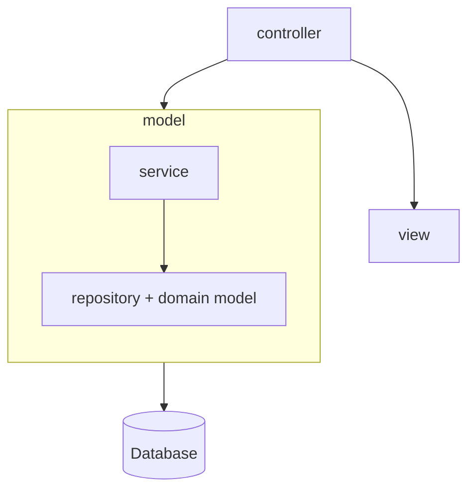
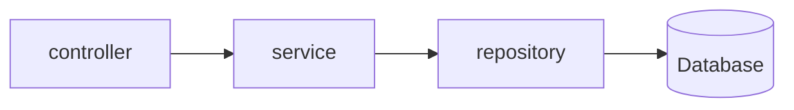

# [Layers](https://login.codingdojo.com/m/315/9533/64296)

## Learning Objective:
Gain a better understanding of MVC Layers

Model:
- domain model
- service layer
- persistence layer

View:
- `.jsp`

Controller:

- `.java` file with `@Controller` annotation.

## MVC Structure

---

## Spring MVC structure

## Communication chart

