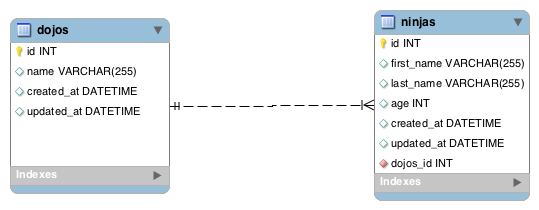

# [One to Many](https://login.codingdojo.com/m/315/9534/64315)



```java
//Dojo.java
...
    @OneToMany(mappedBy="dojo", fetch = FetchType.LAZY)
    private List<Ninja> ninjas;
...
```

```java
//Ninja.java
...
    @ManyToOne(fetch = FetchType.LAZY)
    @JoinColumn(name="dojo_id")
    private Dojo dojo;
...
```